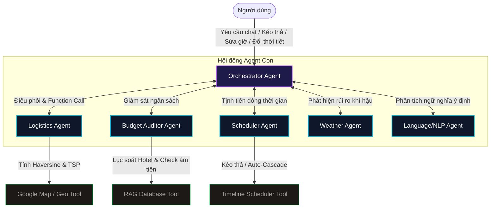

# ViVuAgent HQ - Trợ Lý Du Lịch Đa Tác Nhân Tự Trị Thông Minh 🚀

**Dự án dự thi Vòng Chung Kết Hackathon AIDEV SUMMER 2026**  
**Chủ đề: "KỶ NGUYÊN AI AGENT" | Địa điểm: Lab SE - ĐH FPT Quy Nhơn**  
*Giải pháp lên lịch trình du lịch tự trị tích hợp RAG, TSP Optimization, và Multi-Agent Negotiation cho địa phương Quy Nhơn - Bình Định.*

---

## 🧭 SƠ ĐỒ TRÌNH BÀY NHANH (PITCH DECK OUTLINE)
> [!IMPORTANT]
> **Hook (1 câu ấn tượng):** *"Tại sao chúng ta phải mất 5 tiếng đồng hồ chuẩn bị để rồi đi du lịch Quy Nhơn bị lòng vòng tốn xăng, lố ngân sách và ngập lụt bão lũ bất chợt, trong khi hệ thống 6 AI Agent của ViVuAgent có thể tự trị giải quyết tất cả chỉ trong 3 phút?"*

---

## 🌟 1. Vấn Đề & Tầm Nhìn (Problem & Vision)

### Bối Cảnh Thực Tế
Du lịch Quy Nhơn – Bình Định đang bùng nổ mạnh mẽ với các địa danh kỳ vĩ (Kỳ Co, Eo Gió, Hầm Hô, Chùa Ông Núi). Tuy nhiên, khách du lịch tự túc phải đối mặt với **4 nỗi đau (Pain Points)** lớn:
1. **Lịch trình nhảy cóc (Logistics Pain):** Người dùng tự xếp các điểm đến ở quá xa nhau, dẫn đến tốn thời gian di chuyển, hao phí nhiên liệu.
2. **Lập kế hoạch thủ công mất thời gian:** Phải tự tra cứu thủ công giá phòng, giá vé, khớp múi giờ của từng điểm đến trong nhiều ngày.
3. **Quá tay chi tiêu (Budget Blowout):** Khách sạn và chi phí phát sinh dễ dàng đẩy ngân sách vượt ngưỡng kiểm soát ban đầu.
4. **Biến động thời tiết bất thường (Weather Vulnerability):** Quy Nhơn dễ gặp bão lũ, mưa lớn bất ngờ khiến toàn bộ lịch trình ngoài trời bị hủy, du khách bơ vơ không biết đi đâu chơi trong nhà.

### Giải Pháp & Tầm Nhìn
**ViVuAgent HQ** ra đời để tự động hóa 100% quy trình này, mang đến trải nghiệm du lịch cá nhân hóa, tối ưu chi phí và thích ứng theo thời gian thực (Real-time Adaptive). Chúng tôi kiến tạo một **Hệ điều hành AI Agent** tự trị, lấy dữ liệu thực tiễn và giải quyết triệt để các bài toán khó trên một giao diện thống nhất.

---

## 💻 2. Tech Stack & Công Cụ Sử Dụng (Technology Stack)

Hệ thống được phát triển với cấu trúc tối giản nhưng hiệu năng cao và ổn định tuyệt đối:
*   **Core Framework:** React 18, TypeScript, Vite.
*   **Styling (Giao diện):** TailwindCSS kết hợp Custom CSS tạo nên phong cách **Glassmorphism / Cyberpunk Control Panel** viễn tưởng, tạo ấn tượng mạnh mẽ (WOW effect) từ cái nhìn đầu tiên với Ban Giám Khảo.
*   **AI Engine (Trí Tuệ Nhân Tạo):** API Google Gemini (`gemini-2.5-flash`) hoạt động dưới nền.
*   **API Security & Reliability:** Cơ chế **Exponential Backoff & Auto-Retry** tùy biến trong [geminiService.ts](file:///Users/lilnhan/Desktop/AIDEV/src/services/geminiService.ts) giúp ứng dụng không bị sập (crash) hoặc đứng hình khi gặp lỗi quá tải tần suất gọi (429 Rate Limit) từ nhà cung cấp.
*   **Knowledge Base (Cơ sở Tri thức):** Cơ sở dữ liệu RAG nội bộ chuẩn hóa ([rag_database.json](file:///Users/lilnhan/Desktop/AIDEV/src/data/rag_database.json)) chứa tọa độ địa lý, mô tả chi tiết, giá vé, hình ảnh, chỉ số mạng xã hội (Social Buzz) và mã nhúng video TikTok thực tế của các địa danh nổi tiếng tại Quy Nhơn.
*   **Core Algorithms (Lõi Thuật toán):**
    *   **Haversine Formula:** Lượng giác cầu tính khoảng cách địa lý đường cong thực tế dựa trên vĩ độ/kinh độ (Lat/Lng).
    *   **TSP Solver (Traveling Salesperson Problem):** Áp dụng **Sinh Hoán Vị (Brute-force Permutations)** cho số điểm nhỏ (<=8) và **Greedy Nearest Neighbor** cho số điểm lớn để tự động sắp xếp tối ưu lộ trình ngắn nhất trong ngày.
    *   **K-Means Clustering Heuristic:** Thuật toán gom cụm các địa điểm gần nhau vào chung 1 ngày bằng cách chọn Seed và dùng lực hút Haversine.
    *   **Cascade Time Calculation:** Tính **Tỷ lệ nén (Compression Ratio)** để ép các hoạt động vào khung giờ hợp lý (8h-23h) và tịnh tiến, co giãn thời lượng của các sự kiện liền kề để tránh xung đột múi giờ khi người dùng kéo thả.
    *   **Budget Cut & Hybrid Walk:** Thuật toán sắp xếp chi phí giảm dần (Cost Descending) để gợi ý cắt giảm chi tiêu, kết hợp thuật toán tối ưu đi bộ khi khoảng cách < 1.5km.

---

## 🤖 3. Kiến Trúc Hệ Thống Đa Tác Nhân (Multi-Agent Architecture)

ViVuAgent HQ hoạt động dựa trên mô hình **Multi-Agent Coordination** (Điều phối đa tác nhân). Thay vì dựa vào 1 LLM duy nhất xử lý từ đầu đến cuối, hệ thống chia nhỏ thành **6 chuyên gia AI** tương tác chéo với nhau:



### Chi Tiết Vai Trò Từng Agent:
1.  **Orchestrator Agent (Tổng Chỉ Huy):**
    *   **Vai trò:** Hạt nhân điều hành trung tâm. Lắng nghe mọi thay đổi trạng thái và hành vi của người dùng từ giao diện hoặc chatbox.
    *   **Nhiệm vụ:** Phân tích bối cảnh, kích hoạt các Agent chuyên môn khác hoạt động theo chuỗi logic (Chain of Thought), quản lý chức năng **Function Calling** để liên kết các tác vụ hệ thống.
2.  **Logistics Agent (Não Bộ Địa Lý):**
    *   **Vai trò:** Chuyên gia định tuyến và đo đạc không gian.
    *   **Nhiệm vụ:** Tính toán khoảng cách địa lý giữa các điểm đến và khách sạn bằng công thức Haversine. Khi được gọi, tự động giải bài toán TSP (Traveling Salesperson Problem) để sắp xếp thứ tự di chuyển ngắn nhất cho du khách.
3.  **Budget Auditor Agent (Kiểm Toán Viên):**
    *   **Vai trò:** Giám sát dòng tiền và tối ưu tài chính.
    *   **Nhiệm vụ:** Liên tục kiểm soát tổng chi phí (Hotel + Vé tham quan + Ăn uống). Nếu phát hiện ngân sách bị **ÂM**, Agent này tự trị (Autonomy) quét CSDL RAG, áp dụng thuật toán trọng số đánh đổi giữa giá phòng và khoảng cách địa lý để tìm ra khách sạn giá hợp lý hơn, tạo đề xuất cứu trợ ngân sách.
4.  **Scheduler Agent (Lập Trình Viên Dòng Thời Gian):**
    *   **Vai trò:** Chuyên gia quản lý thời gian biểu.
    *   **Nhiệm vụ:** Đảm bảo tính liên tục của lịch trình. Khi người dùng dịch chuyển hoặc thay đổi thời lượng của 1 địa điểm, Scheduler tự động áp dụng cơ chế **Auto-Cascade** (Lan tỏa thời gian kề tiếp) để các mốc giờ tự động tịnh tiến hoặc cắt xén một cách hợp lý, ngăn ngừa việc 2 địa điểm bị trùng giờ nhau.
5.  **Weather Agent (Giám Sát Môi Trường):**
    *   **Vai trò:** Chuyên gia phòng chống thiên tai.
    *   **Nhiệm vụ:** Giám sát chỉ số thời tiết. Khi phát hiện tín hiệu bão lũ ("Storm"), Weather Agent sẽ phát tín hiệu khẩn cấp, kích hoạt giao thức an toàn.
6.  **Language Agent (NLP - Phân Tích Ý Định):**
    *   **Vai trò:** Bộ máy thông dịch hội thoại.
    *   **Nhiệm vụ:** Phân tích tin nhắn chat tự do của người dùng để bóc tách ý định (Intent: muốn ăn, uống cafe, đi dạo, mua sắm hoặc đổi phòng) cùng các siêu tham số kèm theo (thời gian, ngày mong muốn) để truyền lại cho Orchestrator.

---

## 🗺️ 4. Quy Trình Vận Hành 5 Bước (Step-by-Step System Flow)

Dự án được thiết kế thành một chuỗi luồng công việc logic, đưa người dùng đi qua từng giai đoạn một cách mượt mà và trực quan:

### BƯỚC 1: SURVEY AGENT (Khảo Sát & Receptor dữ liệu đầu vào)
*   **Nhiệm vụ:** Đóng vai trò là một "Lễ tân" ảo để thu thập "Context" (Ngữ cảnh) làm hệ quy chiếu cho tất cả các quyết định của Agent ở các bước sau.
*   **Hoạt động:** Người dùng nhập các thông số đầu vào thiết yếu (Số ngày đi, Tổng ngân sách, Phương tiện di chuyển, Vibe). Đặc biệt, hệ thống tích hợp **Trợ Lý AI Tự Động Điền** cho phép nhập mô tả ngôn ngữ tự nhiên. AI sẽ trích xuất tham số của form đồng thời chạy thuật toán đối chiếu ngữ nghĩa (Semantic Matching) để tự động chọn trước các địa điểm du lịch mong muốn. Dữ liệu sau đó được đóng gói thành `SurveyDTO`.
*   *Chi tiết kỹ thuật có tại [01_STEP1_SURVEY.md](file:///Users/lilnhan/Desktop/AIDEV/reports/01_STEP1_SURVEY.md).*

### BƯỚC 2: RAG POOL & EXPLORATION (Khám Phá Địa Danh Địa Phương)
*   **Nhiệm vụ:** Mô phỏng quá trình lọc và nạp dữ liệu RAG (Retrieval-Augmented Generation).
*   **Hoạt động:** 
    *   Giao diện được chia thành 3 cột tối ưu: **Cột trái** hiển thị chi tiết điểm đến kèm video TikTok sinh động; **Cột giữa** là Bản đồ Quy Nhơn tự động bay (Fly/Zoom) trực tiếp vào tọa độ khi người dùng click; **Cột phải** là danh sách địa danh truy xuất từ `rag_database.json`.
    *   **Pre-selected Destinations:** Các địa danh thích hợp được trích xuất bởi Trợ Lý AI ở Bước 1 sẽ được chọn sẵn tự động tại đây, giúp người dùng tiết kiệm thao tác click chuột.
    *   Hệ thống giới hạn nghiêm ngặt **tối đa 4 địa điểm** được lựa chọn nhằm đảm bảo Context Window gửi lên LLM không bị quá tải và lịch trình không bị nhồi nhét phi thực tế. Người dùng có thể nhấn nút thời tiết giả lập để đưa ra quyết định chọn bãi biển hay điểm tham quan trong nhà.
*   *Chi tiết kỹ thuật có tại [02_STEP2_PICKER.md](file:///Users/lilnhan/Desktop/AIDEV/reports/02_STEP2_PICKER.md).*

### BƯỚC 3: MULTI-AGENT NEGOTIATION (Hội Đồng Cố Vấn Khách Sạn)
*   **Nhiệm vụ:** Trực quan hóa tiến trình đàm phán, tìm kiếm tiếng nói chung giữa Logistics Agent và Budget Auditor để đề xuất khách sạn.
*   **Hoạt động:** 
    *   **Logistics Agent** đo lường tọa độ địa lý, tính toán tổng khoảng cách từ từng khách sạn tiềm năng đến 4 tụ điểm đã chọn ở Bước 2.
    *   **Budget Auditor** đối chiếu giá phòng với Ngân sách của người dùng.
    *   Các khách sạn được xếp hạng tự động dựa trên độ tối ưu khoảng cách và giá cả. Cột giữa tự động vẽ các đường nối (Polyline) từ Khách sạn đang trỏ chuột đến các địa điểm vui chơi.
    *   Bảng điều khiển Console Log giả lập (kiểu chữ Hacker xanh lá) hiển thị thời gian thực các dòng lệnh nạp tọa độ, tính toán khoảng cách và trừ ngân sách, giúp người dùng nắm bắt được logic tư duy của AI.
*   *Chi tiết kỹ thuật có tại [03_STEP3_NEGOTIATION.md](file:///Users/lilnhan/Desktop/AIDEV/reports/03_STEP3_NEGOTIATION.md).*

### BƯỚC 4: LLM ENGINE (Khởi Chạy Sinh Lịch Trình Tự Động)
*   **Nhiệm vụ:** Đóng gói JSON Schema Payload và đẩy lên Google Gemini API.
*   **Hoạt động:** 
    *   Đây là màn hình chờ (Loading screen) mang đậm tính công nghệ cao. Thay vì dùng vòng xoay Loading nhàm chán, hệ thống in trực tiếp các tham số thực tế (Ngân sách, Số ngày, Danh sách tọa độ...) lên màn hình Terminal giả lập để thể hiện quá trình AI tổng hợp ngữ cảnh (Compile Context) thành System Prompt định dạng JSON Schema.
    *   Dưới nền, hệ thống kích hoạt cơ chế **Exponential Backoff & Retry** đảm bảo gọi API thành công, trích xuất chuỗi JSON thô từ Gemini và ép kiểu (parse) thành mảng lịch trình khớp hoàn toàn với cấu trúc ứng dụng.
*   *Chi tiết kỹ thuật có tại [04_STEP4_ENGINE.md](file:///Users/lilnhan/Desktop/AIDEV/reports/04_STEP4_ENGINE.md).*

### BƯỚC 5: CONTROL HQ (Trung Tâm Điều Hành - Chỉ Huy Tự Trị)
*   **Nhiệm vụ:** Trái tim điều phối của hệ thống. Nơi người dùng quan sát và tương tác trực tiếp với các Agent thông qua Timeline tương tác, Map vệ tinh và Chatbot Copilot.
*   **Hoạt động & Feature Đỉnh Cao:** 
    *   **Timeline kéo thả (Drag & Drop) & Auto-Cascade:** Cho phép người dùng tùy ý di chuyển địa điểm giữa các ngày, Scheduler Agent sẽ tự tịnh tiến lại toàn bộ mốc thời gian trong ngày. Người dùng cũng có thể chỉnh sửa trực tiếp (Inline Time Editing) thời gian.
    *   **Tối Ưu Hóa Đa Cấp Độ (Multi-turn Optimization):** Khi User yêu cầu "Tối ưu chi phí", AI sẽ tạm dừng hỏi lại mức độ tối ưu. Tùy theo lựa chọn (Nhẹ nhàng/Bình thường/Hết cỡ), AI kích hoạt **Thuật toán Hybrid Walk**. Nó loại bỏ các cuốc xe ngắn dưới 1.5km và ép User đi bộ (chi phí 0đ) trong khi vẫn giữ nguyên phương tiện cho các chặng xa. Lịch trình sẽ tự hiển thị: "Grab + Đi bộ kết hợp".
    *   **Tương tác Ngân sách Động (Dynamic Budgeting):** User có thể ra lệnh "Tăng ngân sách lên 5 triệu". Hệ thống sử dụng Regex trích xuất lập tức đổi số tiền, tính toán lại trạng thái an toàn quỹ phòng hờ mà không bị trễ nhịp nào.
    *   **Phân Tích NLP Dự Phòng (LLM Fallback):** Khi gõ ngày giờ phức tạp (*"Sáng ngày cuối cùng"*), Local Code nếu không bắt được sẽ tự động Kích hoạt Language Agent (Gemini) để bóc tách ý định. Kết hợp hoàn hảo giữa tốc độ (0ms của Regex) và não bộ (Sự thông minh của LLM).
    *   *Chi tiết kỹ thuật có tại [05_STEP5_HQ.md](file:///Users/lilnhan/Desktop/AIDEV/reports/05_STEP5_HQ.md).*

---

## ⚡ 5. Đáp Ứng 4 Tiêu Chí Bắt Buộc Của Ban Tổ Chức Hackathon

Để khẳng định đây là một sản phẩm AI Agent thực chiến chuẩn mực, dưới đây là cách chúng tôi giải quyết 4 yêu cầu bắt buộc của đề bài:

### ① Tính Tự Chủ (Autonomy) - Vòng lặp Act → Observe → Re-plan rõ ràng

Chúng tôi xây dựng các kịch bản tự trị khép kín, hoạt động độc lập không cần sự can thiệp liên tục của con người:

*   **Kịch bản Tự trị 1: Giải Cứu Ngân Sách Bị Âm (Budget Auto-Correction)**
    *   **Observe:** `Budget Auditor` liên tục lắng nghe trạng thái của ví tiền (`remainingBudget`). Khi người dùng thêm hoạt động đắt tiền làm ngân sách bị âm (< 0đ).
    *   **Think:** Agent nhận thấy cần phải đổi khách sạn khác rẻ hơn để bù đắp. Nó tự động truy vấn CSDL RAG và xếp hạng khách sạn thay thế dựa trên tổng chi phí (Tiền phòng + Tiền đi lại theo TSP).
    *   **Act & Re-plan:** Agent tự động tạo ra một đề xuất đề nghị đổi khách sạn. Khi click "Đồng ý", một chuỗi dây chuyền tự trị diễn ra: Thay khách sạn mới -> Trừ lại ngân sách về dương -> Kích hoạt `Logistics Agent` tính toán lại đường đi -> `Scheduler Agent` tịnh tiến lại múi giờ.
*   **Kịch bản Tự trị 2: Ứng Biến Siêu Bão Đổ Bộ (Storm Disaster Recovery)**
    *   **Observe:** Người dùng nhấn nút kích hoạt "Giả lập Siêu Bão". `Weather Agent` lập tức cảnh báo thiên tai và "Chụp" (Snapshot) lại toàn bộ lịch trình gốc.
    *   **Think:** `Language Agent` quét toàn bộ lịch trình hiện tại, sử dụng Regex/NLP để phát hiện từ khóa không an toàn ("biển", "đảo", "dã ngoại"...) hoặc thuộc tính ngoài trời (`isIndoor = false`).
    *   **Act & Re-plan:** Hệ thống tự động hủy các điểm nguy hiểm (gắn nhãn đỏ), truy quét CSDL RAG để tìm các điểm tham quan an toàn trong nhà (như Bảo tàng Quang Trung) để thay thế. Khi bão qua đi, hệ thống tự load lại Bản Snapshot giữ nguyên công sức tinh chỉnh ban đầu của người dùng!

### ② Sử Dụng Công Cụ (Tool Use)

Hệ thống tích hợp ít nhất **4 công cụ** chuyên biệt phục vụ các mục đích rõ ràng:
1.  **Tool 1: RAG Database Query Tool** - Truy vấn dữ liệu địa phương Quy Nhơn theo bộ lọc thời tiết, loại hình (Khách sạn/Điểm tham quan), khoảng giá và thuộc tính.
2.  **Tool 2: Geocoding & Distance Tool (Haversine Engine)** - Nhận tọa độ Lat/Lng và tính toán khoảng cách địa lý thực tế.
3.  **Tool 3: Route Optimization Tool (TSP Solver)** - Giải quyết bài toán Người chào hàng trên tập hợp địa điểm đã chọn bằng phương pháp heuristic Nearest Neighbor.
4.  **Tool 4: Scheduling & Cascade Engine** - Quản lý, sắp đặt thứ tự và lan tỏa (cascade) thời gian tự động trên giao diện kéo thả của Timeline du lịch.
5.  **Tool 5: Hybrid NLP Engine (Regex + LLM Fallback)** - Trình biên dịch thông minh, ưu tiên tốc độ bằng Local Regex nhưng sẵn sàng dùng Gemini API bóc tách các câu nói phức tạp.

### ③ Giá Trị Thực Tiễn (Real Impact)

Dự án không giải quyết bài toán giả tưởng. Chúng tôi tập trung phát triển **Du lịch thông minh Quy Nhơn - Bình Định**:
*   **Tác động định lượng đo lường được:**
    *   **Tiết kiệm 95% thời gian:** Lên lịch trình từ 5 giờ chuẩn bị rút xuống còn **3 phút** nhờ sự hỗ trợ của AI.
    *   **Giảm 30% quãng đường di chuyển:** Nhờ thuật toán **K-Means Clustering** và **TSP** loại bỏ hoàn toàn các chặng đi lòng vòng, nhảy cóc.
    *   **Tối ưu 40% phí đi lại với Hybrid Walk:** Kết hợp cuốc Grab xa và đi bộ gần (<=1.5km), giữ sức khỏe và bảo vệ môi trường.
    *   **Giảm 10-15% chi phí phát sinh:** Nhờ thuật toán **Budget Cut** và sự giám sát chặt chẽ, tự trị gợi ý khách sạn thay thế (phạt theo khoảng cách) của Budget Auditor.
    *   **Bảo vệ an toàn 100%:** Cho du khách trước biến động thời tiết cực đoan của miền Trung thông qua Weather Agent.
*   **Người dùng thực tế:** Học sinh, sinh viên, các cặp đôi, gia đình và khách du lịch lần đầu đến Quy Nhơn cần một giải pháp lập kế hoạch nhanh chóng, đáng tin cậy.

### ④ Demo Trực Tiếp (Live Demo)

Sản phẩm chạy hoàn toàn trên Web Browser của laptop đội thi trước Ban Giám Khảo:
*   Mọi chức năng: Kéo thả hoạt động, đổi thời tiết siêu bão, tính TSP, chat đa ý định đều diễn ra lập tức với hiệu ứng chuyển động mượt mà.
*   Độ trễ (Latency) khi gọi Gemini API được xử lý tinh tế bằng giao diện Terminal Typewriter sang trọng, giúp duy trì sự chú ý của người xem mà không gây cảm giác chờ đợi mệt mỏi.

---

## 🛠️ 6. Hướng Dẫn Cài Đặt & Khởi Chạy (Setup & Run)

Dành cho Ban Giám Khảo muốn chạy thử nghiệm dự án trực tiếp trên máy cá nhân:

### 1. Yêu Cầu Môi Trường
*   Đã cài đặt **Node.js** (Phiên bản v18 trở lên).
*   Có sẵn trình quản lý gói **npm** hoặc **yarn**.

### 2. Các Bước Khởi Chạy
```bash
# Bước 1: Di chuyển vào thư mục dự án
cd /Users/lilnhan/Desktop/AIDEV

# Bước 2: Cài đặt các thư viện phụ thuộc
npm install

# Bước 3: Cài đặt biến môi trường API Key
# Tạo file .env ở thư mục gốc (hoặc chỉnh sửa file .env có sẵn)
# Nội dung file: VITE_GEMINI_API_KEY=AIzaSy... (API Key của bạn)

# Bước 4: Khởi chạy chế độ phát triển
npm run dev
```
Mở trình duyệt và truy cập: **`http://localhost:5173`** để bắt đầu trải nghiệm.

---

## 📝 7. Tài Liệu Phản Tư (Reflection Doc)

### Điều Khó Khăn Nhất Khi Thực Hiện Dự Án?
Đó là **quản lý và đồng bộ hóa trạng thái (State Management) phức tạp** của hệ thống. Khi một hành động xảy ra (ví dụ: người dùng chấp nhận đổi khách sạn sang một lựa chọn rẻ hơn trong hộp thoại chat), hàng loạt thay đổi dây chuyền phải được thực thi đồng bộ: khách sạn trên Timeline thay đổi, ví tiền cập nhật lại, bản đồ vẽ lại đường nối, Logistics Agent tự chạy lại TSP tối ưu đường đi và Scheduler Agent tính toán lại các mốc thời gian. Việc thực hiện deep clone toàn bộ mảng dữ liệu đa cấp trong React nhằm tránh đột biến state (mutating state) ngoài ý muốn đòi hỏi sự tỉ mỉ rất lớn trong thiết kế mã nguồn.

### Nếu Có Thêm 1 Tuần, Nhóm Sẽ Làm Gì?
1.  **Tích hợp API bản đồ thực tế:** Thay thế Google Map giả lập bằng Google Maps JavaScript API thực tế hoặc Mapbox để hỗ trợ hiển thị tuyến đường đi thực, tính toán thời gian di chuyển dựa trên mật độ giao thông thời gian thực thay vì chỉ dùng khoảng cách đường chim bay (Haversine).
2.  **Đọc và xử lý tài liệu ngoại bang (OCR & File Tool):** Cho phép người dùng tải lên file ảnh chụp tờ rơi hoặc file PDF lịch trình du lịch có sẵn, AI Agent sẽ tự động trích xuất thông tin (OCR) để import trực tiếp vào hệ thống.
3.  **Hỗ trợ đặt chỗ thực tế (Integration with Booking APIs):** Liên kết với các API của Agoda, Klook để cho phép người dùng đặt phòng khách sạn hoặc mua vé trực tiếp từ giao diện ViVuAgent.

### Bài Học Kỹ Thuật Lớn Nhất Rút Ra?
*   **Thiết kế Multi-Agent vượt trội hơn Single-Prompt:** Việc chia nhỏ các nhiệm vụ phức tạp (quản lý tiền, quản lý thời gian, định vị địa lý) cho các Agent chuyên môn hóa và điều phối chúng thông qua một Orchestrator trung tâm mang lại sự ổn định và dễ gỡ lỗi (debug) hơn rất nhiều so với việc cố viết một System Prompt thật dài để bắt một LLM duy nhất làm toàn bộ công việc.
*   **Cơ chế phòng ngừa lỗi là bắt buộc:** Khi phát triển ứng dụng sử dụng LLM, việc tích hợp các cơ chế như Exponential Backoff & Retry giúp trải nghiệm người dùng không bao giờ bị đứt quãng bởi các yếu tố khách quan từ phía nhà cung cấp API.

---
*Phát triển bởi đội thi ViVuAgent - ĐH FPT Quy Nhơn tại Hackathon AIDEV Summer 2026. Hướng tới một tương lai du lịch tự trị thông minh hơn!*